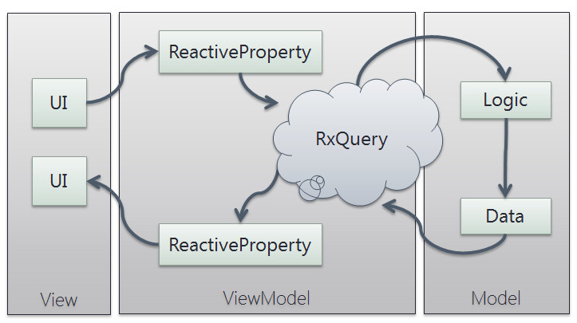
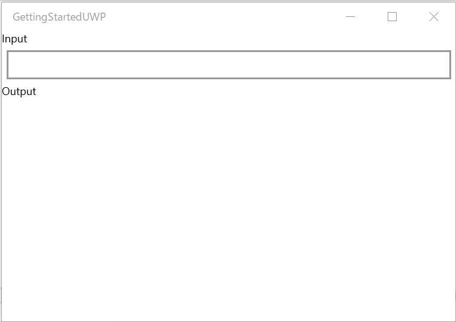

[Japanese](http://blog.okazuki.jp/entry/2015/12/05/221154)

# ReactiveProperty

ReactiveProperty provides MVVM and asynchronous support features under Reactive Extensions. Target framework is .NET 4.6, UWP, Xamarin.iOS, Xamarin.Android, Xamarin.Mac, Xamarin.Forms and .NET Standard 1.3.




ReactiveProperty is very powful and simple library.



This sample app's ViewModel code is as below:

```cs
public class MainPageViewModel
{
    public ReactiveProperty<string> Input { get; }
    public ReadOnlyReactiveProperty<string> Output { get; }
    public MainPageViewModel()
    {
        Input = new ReactiveProperty<string>("");
        Output = Input
            .Delay(TimeSpan.FromSeconds(1))
            .Select(x => x.ToUpper())
            .ToReadOnlyReactiveProperty();
    }
}
```

It's LINQ and Rx magic.

All steps are written getting started section in the [ReactiveProperty documentation](https://runceel.github.io/ReactiveProperty/).

This library's concept is "Fun programing". 
ViewModel code which using ReactiveProperty is very simple.


ViewModel's popular implementation is as below:
```cs
public class AViewModel : INotifyPropertyChanged
{
    public event PropertyChangedEventHandler PropertyChanged;

    private string _name;
    public string Name
    {
        get => _name;
        set
        {
            _name = value;
            PropertyChanged?.Invoke(this, new PropertyChangedEventArgs(nameof(Name)));

            // Update a command status
            DoSomethingCommand.RaiseCanExecuteChanged();
        }
    }

    private string _memo;
    public string Memo
    {
        get => _memo;
        set
        {
            _memo = value;
            PropertyChanged?.Invoke(this, new PropertyChangedEventArgs(nameof(Memo)));

            // Update a command status
            DoSomethingCommand.RaiseCanExecuteChanged();
        }
    }

    // DelegateCommand is plane ICommand implementation.
    public DelegateCommand DoSomethingCommand { get; }

    public AViewModel()
    {
        DoSomethingCommand = new DelegateCommand(
            () => { ... },
            () => !string.IsNullOrEmpty(Name) && !string.IsNullOrEmpty(Memo)
        );
    }
}
```

Binding code is as below:
```xml
<TextBlock Text="{Binding Name}">
<TextBlock Text="{Binding Memo}">
```

ViewModel's implementation using ReactiveProperty is as below:
```cs
public class AViewModel
{
    public ReactiveProperty<string> Name { get; }
    public ReactiveProperty<string> Memo { get; }
    public RxCommand DoSomethingCommand { get; }

    public AViewModel()
    {
        Name = new ReactiveProperty<string>()
            .SetValidateNotifyError(x => string.IsNullOrEmpty(x) ? "Invalid value" : null);
        Memo = new ReactiveProperty<string>()
            .SetValidateNotifyError(x => string.IsNullOrEmpty(x) ? "Invalid value" : null);
        DoSomethingCommand = new[]
            {
                Name.ObserveHasErrors,
                Memo.ObserveHasErrors,
            }
            .CombineLatestValuesAreAllFalse()
            .ToRxCommand()
            .WithSubscribe(() => { ... });
    }
}
```

Binding code is as below:
```xml
<TextBlock Text="{Binding Name.Value}">
<TextBlock Text="{Binding Memo.Value}">
```

It's very simple.

ReactiveProperty doesn't provide base class by ViewModel.
It's means that ReactiveProperty can use together the another MVVM library like Prism, MVVMLight, etc...

## Documentation

[ReactiveProperty documentation](https://runceel.github.io/ReactiveProperty/)

## NuGet

[ReactiveProperrty](https://www.nuget.org/packages/ReactiveProperty)

## Author info

Yoshifumi Kawai a.k.a. [@neuecc](https://twitter.com/neuecc) is software developer in Tokyo, Japan.
Awarded Microsoft MVP for Visual Studio and Development Technologies since April, 2011.

Takaaki Suzuki a.k.a. [@xin9le](https://twitter.com/xin9le) software devleoper in Tokyo, Japan.
Awarded Microsoft MVP for Visual Studio and Development Technologies since July, 2012.

Kazuki Ota a.k.a. [@okazuki](https://twitter.com/okazuki) software developer in Tokyo, Japan.
